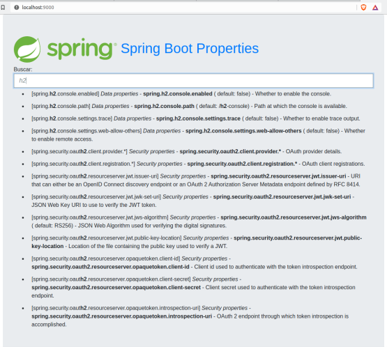

# springbootproperties
#### ----------------------------------------------------------------

> #### Spring Boot 
> ###### Acelere o desenvolvimento de microsserviços
>>> ##### Fernando Boaglio - Casa do Código
Capítulo 3

#### Para excutar o aplicativo é necessário baixar ou clonar todo o projeto.

> 1 - Navegar até a pasta do aplicativo:

  >> $ cd learnSpring/casadocodigo/boaglio/springbootproperties/

> 2 - Instalar as dependências:

  >> $ npm install

>3 - Iniciar o aplicativo:

  >> $ mvn spring-boot:run

>4 - Acessar o aplicativo com um navegador:

  >> http://localhost:9000

>5 - Resultado:

  >> Digite h2 no campo de pesquisa ...

  >>
